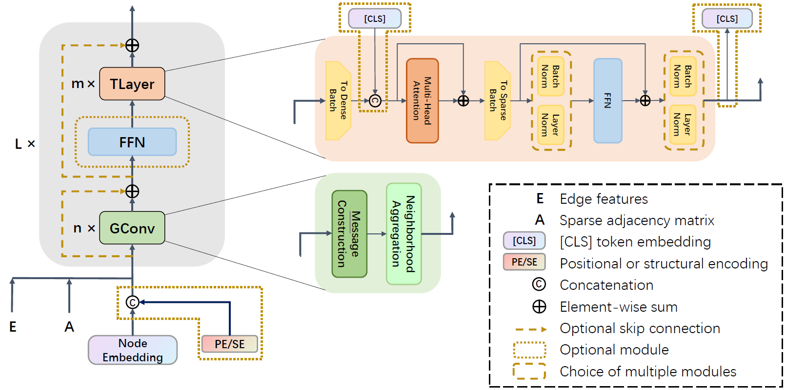

<!--
<style>
img{
    width:80%;
    padding-left: 10%;
}
</style>
-->

# LGI-GT: Graph Transformers with Local and Global Operators Interleaving

We categorize existing graph Transformers into 2 types:
- **Type Ⅰ** combines Transformer encoder with connectivity information and edge features via specially tailored attention computing formulas or graph-related positional encodings (PE/SE). This class of GTs can be regarded as independent of GNNs, e.g., Graphormer, SAN, UniMP and GRPE.
- **Type Ⅱ** explicitly utilizes both of the message passing GNN modules and Transformer encoder layers, such as GraphTrans, SAT and GPS.

Our **LGI-GT** belongs to Type Ⅱ, consisting in an interleaving scheme to construct GTs with local operators and global operators (i.e., GConvs and TLayers, respectively). The model architecure of LGI-GT are as follows:
<!-- <br/><br/> <br/> -->
<br/>
<div align=center>

</div>
<br/>
LGI scheme is a general framework, where GConv can be any message passing modules, while TLayer also can be replaced by linear Transformer variants for the sake of low complexity.

If we also use attention-based message passing module as the GConv, then a full-attention LGI-GT comes up. We also propose a novel attention-based GConv --- **Edge Enhanced Local Attention (EELA)**, which is more suitable for the proposed LGI-GT than the previous counterparts like GATConv and TransformerConv.

LGI-GT is built using [PyTorch](https://pytorch.org/) and [PyG](https://www.pyg.org/). Specifically *Pytorch v1.8.0* and *PyG v2.0.4* are required, and package requirements are concluded in `requirements.txt`


### Python environment setup

```bash
conda create -n lgi_gt python=3.9
conda activate lgi_gt

# (torch related 'cu' number depends on the version of cuda toolkit installed)
pip install torch==1.8.0+cu111
pip install torch-sparse torch-scatter -f https://data.pyg.org/whl/torch-1.8.0+cu111.html
pip install torch-geometric==2.0.4
pip install ogb==1.3.4
pip install jupyter

```


### Running LGI-GT
```bash

# ZINC
python main.py --configs configs/zinc.yml

# PATTERN
python main.py --configs configs/pattern.yml

# CLUSTER
python main.py --configs configs/cluster.yml

# ogbg-molpcba
python main.py --configs configs/ogbg-molpcba.yml

# ogbg-code2
python main.py --configs configs/ogbg-code2.yml
```
### Citation
Please cite our paper if our code is useful for your research:
```
@article{yinlgi,
  title={LGI-GT: Graph Transformers with Local and Global Operators Interleaving},
  author={Yin, Shuo and Zhong, Guoqiang}
}
```
